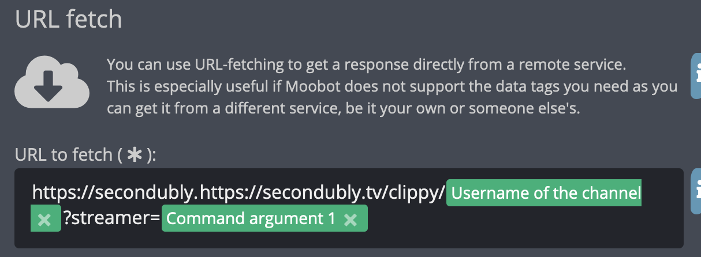

# Clippy

A stream overlay API that selects a 15 second (or less) weighted-random top clip from a given channel.

# Instructions

This can be used as a browser source within a twitch bot, simply create a browser source and set the URL field to the following: `https://secondubly.tv/clippy/<your_twitch_username>`

Below I've included steps to use this as a command in some popular Twitch bots, if you'd like to see your bot included here, simply make a request!

## Moobot
1. In your Moobot dashboard (https://moo.bot) create a new custom command, naming it whatever oyu want (for this example, we will use `!clippy`) and click “Create”
2. In the `Response` field, select `URL Fetch - Full (plain) response`.
3. In the `URL to fetch (*)` field, type the following: `https://secondubly.tv/clippy/<Username of the channel>?streamer=Command argument 1`, it should look something like this:

4. That's it! You can save and use the command as follows: `!clippy <a username here>`

## Nightbot
1. In your Nightbot Dashboard (https://nightbot.tv/dashboard) create a new custom command, naming it whatever you want. (for this example, we will use `!clippy`)
2. In the message field, type the following: `$(urlfetch https://secondubly.tv/clippy/$(channel)?streamer=$(1))`
3. That's it! You can use the command as follows: `!clippy <a username here>`

## Phantombot
1. In your Phantombot dashboard go to the commands -> custom commands section.
2. Create a custom command (for this example we will be using `!clippy`)
3. In the response field, type the following: `(customapi $(urlfetch https://secondubly.tv/clippy/$(channel)?streamer=$(1)))`
4. That's it! You can use the command as follows: `!clippy <a username here>`

## Streamlabs Chat Bot (AKA Cloudbot)
1. In your Streamlabs Dashboard (https://streamlabs.com/dashboard) navigate to the Cloudbot section
2. Navigate to the Commands tab and click “Add Command” (for this example we will use `!clippy`)
3. Leave the Template field blank, but enter the command name in the “Command” field
4. In the Response field, type the following: `{readapi.https://secondubly.tv/clippy/{channel.name}?streamer={1}}`
5. That's it! You can use the command as follows: `!clippy <a username here>`

## Streamelements Chat Bot
1. In your Streamelements Dashboard (https://streamelements.com/dashboard) navigate to the Chat Bot asection
2. Navigate to the Chat commands section and click the “Custom Commands” tab, then click “Add New Command”
3. Make sure the “New command” radio button is filled in, and enter the command name in the command name field (it should say “what triggers the response?”) beneath it.
4. In the response field, type the following: `${urlfetch https://secondubly.tv/clippy/${channel.display_name}?streamer=${1}}`
5. That's it! You can use the command as follows: `!clippy <a username here>`
